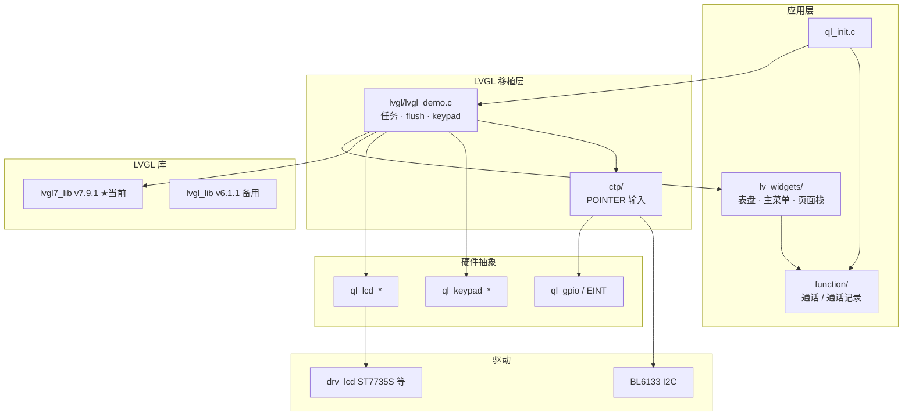

# 01 架构总览

## 1. 工程在整棵树里的位置

8910 OpenSDK 是「内核组件 + 应用组件」结构。LVGL 全部落在应用侧，LCD 底层驱动在 `components/driver`。

```
8910DM_LVGL/
├── components/
│   ├── driver/src/lcd/              # 屏驱：ST7735S(128x128) / GC9305 / ST7789V / GC9307
│   ├── ql-kernel/inc/ql_lcd.h       # 应用可见的 LCD API
│   └── ql-application/              # ★ LVGL 相关都在这里
│       ├── init/ql_init.c           # 应用入口，拉起 GUI
│       ├── lvgl/                    # GUI 线程 + 显示/按键移植
│       ├── lvgl7_lib/               # 当前使用的 LVGL 7.9.1
│       ├── lvgl_lib/                # 旧版 LVGL 6.1.1（V7 关闭时才编）
│       ├── lv_widgets/              # 手表 UI（表盘/菜单/通话界面）
│       ├── ctp/                     # 电容触摸（BL6133）
│       ├── lcd/                     # LCD 裸刷 demo（当前 init 里注释掉了）
│       └── function/                # 业务：通话、通话记录
├── simulator/lvgl/                  # PC 模拟：Windows VS / Ubuntu SDL2
├── tools/lvgl/                      # 字体/图片/i18n 工具
├── projects/C56U_HM_SH8/            # 项目级 cmake 覆盖
└── gengtao_doc/                     # 本梳理文档
```

## 2. 分层



## 3. 两套 LVGL 如何选型

`components/ql-application/CMakeLists.txt`：

```
QL_APP_FEATURE_LCD
  └─ QL_APP_FEATURE_LVGL
        ├─ QL_APP_FEATURE_LVGL_V7 = ON  →  lvgl7_lib + lv_widgets
        └─ QL_APP_FEATURE_LVGL_V7 = OFF →  lvgl_lib（无 lv_widgets）
        └─ 无论 V7 与否都会编 lvgl/（ql_app_lvgl）
```

开关来源：`ql_app_feature_config.cmake`。只要内核开了 `CONFIG_QUEC_PROJECT_FEATURE_LCD`，应用侧默认：

- `QL_APP_FEATURE_LCD` = ON
- `QL_APP_FEATURE_LVGL` = ON
- `QL_APP_FEATURE_LVGL_V7` = ON

`ql_target.cmake` 里 `CONFIG_QUEC_PROJECT_FEATURE_LCD` 当前是 **on**。

| 项 | lvgl_lib | lvgl7_lib（当前） |
|----|----------|-------------------|
| 版本 | 6.1.1 | 7.9.1 |
| 控件目录 | `lv_objx/` | `lv_widgets/` |
| PNG | 无 | `lv_lib_png/` |
| 分辨率宏 | 128×128 | 128×128 |
| 息屏超时 | 5s | 30 分钟 |
| Tick | 自定义 | `ql_rtc_up_time_ms()` |
| 配套 UI | 无 | `lv_widgets` |

GUI 线程里也按宏分叉：

- V7：入口回调是 `main_screen`
- 非 V7：入口回调是 `lvglAnimCreate`（声明了但当前 demo 没定义，走 V6 会编不过）

**结论：当前固件只走 LVGL 7 + lv_widgets。**

## 4. 关键源文件地图

| 职责 | 路径 |
|------|------|
| 应用启动 | `components/ql-application/init/ql_init.c` |
| GUI 线程 / flush / keypad / 息屏 | `components/ql-application/lvgl/lvgl_demo.c` |
| LVGL 7 配置 | `lvgl7_lib/lv_conf.h`、`lv_gui_config.h` |
| 页面栈 | `lv_widgets/screen_manager.c` |
| 待机表盘 | `lv_widgets/main_screen.c` |
| 主菜单 | `lv_widgets/mainmenu.c`、`mainmenu/` |
| 表盘资源表 | `lv_widgets/clockface/` |
| 图片 C 数组 | `lv_widgets/assets/output/` |
| 中文字体 | `lv_widgets/fonts/opposans_14.c` |
| 触摸桥接 | `ctp/ctp_main.c` |
| 触摸 IC | `ctp/bl6133/` |
| 通话业务 | `function/call/ic_call_phone.c` |
| LCD 应用 API | `ql-kernel/inc/ql_lcd.h` |
| 128×128 屏驱 | `driver/src/lcd/drv_lcd_st7735s.c` |

## 5. 不参与当前固件的路径（避免看错）

| 路径 | 说明 |
|------|------|
| `lvgl_lib/` | LVGL 6，仅 `QL_APP_FEATURE_LVGL_V7=OFF` 时编译 |
| `lvgl7_lib/lv_port/`、`lvgl_lib/lv_port/` | RDA 原移植（`drv_lcd_v2` / `osiTimer`），CMake **未加入** `target_sources` |
| `lcd/lcd_demo.c` | 裸刷色块 demo，`ql_init.c` 里 `ql_lcd_app_init()` 已注释 |
| `simulator/lvgl/` | PC 模拟，不进设备固件 |
| `tools/lvgl/` | 资源转换工具，不进设备固件 |
