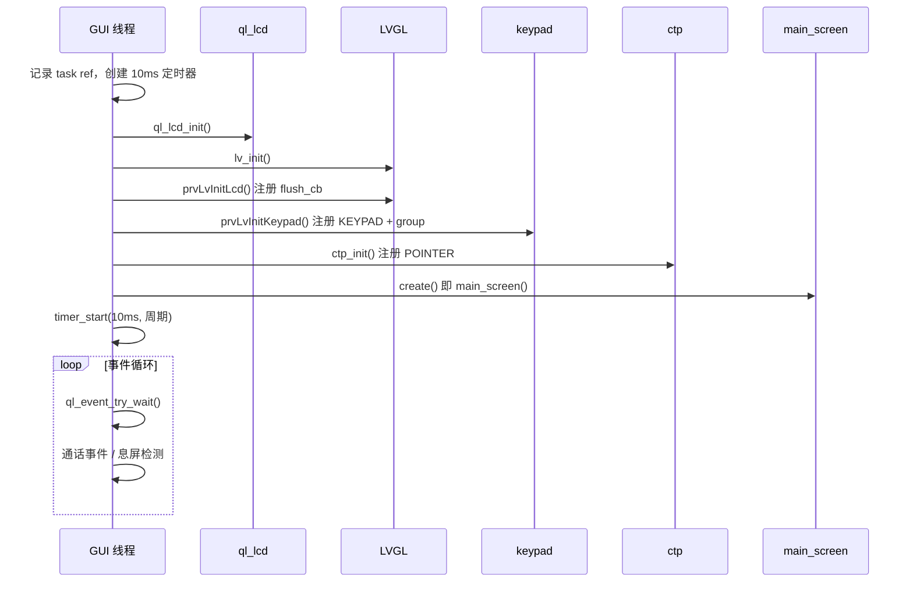

# 02 启动与任务循环

## 1. 应用入口

`ql_init.c` 在 LCD + LVGL 都开时只拉两条线（LCD 裸 demo 被注释掉）：

```c
#ifdef QL_APP_FEATURE_LCD
    //ql_lcd_app_init();
#ifdef QL_APP_FEATURE_LVGL
    ql_lvgl_app_init();
    ic_main_entry();   // 通话回调注册 + 通话记录初始化
#endif
#endif
```

`ic_main_entry()`（`function/main/ic_mian.c`）不创建界面，只做业务初始化。界面由 GUI 线程回调 `main_screen()` 创建。

## 2. GUI 任务创建

`ql_lvgl_app_init()`：

| 项 | 值 |
|----|----|
| 任务名 | `QLVGLDEMO` |
| 栈 | `1024*4` = 4KB（偏紧，复杂 UI 容易炸栈） |
| 优先级 | `APP_PRIORITY_NORMAL` |
| 事件槽 | 5 |
| 线程参数 | V7：`main_screen`；非 V7：`lvglAnimCreate` |

任务句柄：`lvgl_gui_task`。

## 3. 线程内初始化顺序

`ql_lvgl_demo_thread()` 必须按下面顺序，否则 flush / 触摸会踩空：



细节：

1. `ql_lcd_init()` 失败则线程直接退出。
2. `prvLvInitLcd()` 按 `CONFIG_LV_GUI_HOR_RES × VER_RES` **整屏 malloc 一块 RGB565 buffer**，再 `lv_disp_drv_register`。
3. `prvLvInitKeypad()` 配 5×5 矩阵，创建 `lv_group`，按键走 group 导航。
4. `ctp_init()` 再建 POINTER 输入设备（与 keypad 并存）。
5. 把线程参数当 `lvGuiCreate_t` 调用，V7 即 `main_screen()`。
6. 定时器 10ms 周期触发 `prvLvTaskHandler()`。

## 4. `lv_task_handler` 怎么跑

```c
static void prvLvTaskHandler(void)
{
    lv_task_handler();
#ifdef QL_APP_FEATURE_LVGL_V7
    ql_rtos_timer_start(d->task_timer, 10, TRUE);   // 固定 10ms
#else
    unsigned next_run = lv_task_get_tick_next_run();
    ql_rtos_timer_start_relaxed(d->task_timer, next_run, TRUE, QL_WAIT_FOREVER);
    lv_refr_now(d->disp);
#endif
}
```

当前 V7：**固定 10ms** 调一次 `lv_task_handler()`。  
LVGL 内部刷新周期 `LV_DISP_DEF_REFR_PERIOD = 30ms`，输入读周期 `LV_INDEV_DEF_READ_PERIOD = 30ms`。

Tick 不靠 `lv_tick_inc()`，而是：

```c
#define LV_TICK_CUSTOM 1
#define LV_TICK_CUSTOM_INCLUDE "ql_api_rtc.h"
#define LV_TICK_CUSTOM_SYS_TIME_EXPR (ql_rtc_up_time_ms())
```

## 5. 线程主循环在干什么

初始化完成后线程并不在循环里刷屏（刷屏由定时器回调完成），循环只处理：

| 事件 | 行为 |
|------|------|
| `QUEC_LVGL_QUIT_IND` | 退出线程 |
| `QL_VC_INIT_OK_IND` ~ `QL_VC_CCWA_IND` | 交给 `ic_vc_call_event()` |
| 无用户占用 + 超时 | `lvGuiScreenOff()` → `ql_lcd_display_off()` |

息屏策略：

- `inactive_timeout` 默认 `CONFIG_LV_GUI_SCREEN_OFF_TIMEOUT`（V7 为 30 分钟）
- `lvGuiRequestSceenOn(id)` / `lvGuiReleaseScreenOn(id)` 用 32bit bitmap 占用亮屏
- 若 `anim_inactive == false` 且还有动画在跑，不算超时

对外亮灭屏 API：`lvGuiScreenOn()` / `lvGuiScreenOff()`。

## 6. 和业务线程的关系

- GUI 必须在 LVGL 线程里改控件（LVGL 7 非线程安全）。
- 跨线程应 `lvGuiSendEvent()` 丢到 GUI 任务，或自己用 `ql_rtos_event_send(lvgl_gui_task, ...)`。
- 通话：`ic_main_entry()` 注册语音回调；GUI 循环里再吃 `QL_VC_*` 事件。注意当前实现吃到通话事件后有 `break`，会把 GUI 线程结束掉，见 [06_已知问题与后续工作.md](06_已知问题与后续工作.md)。
