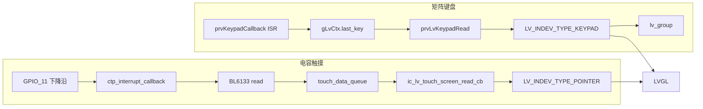

# 03 显示与输入

## 1. 显示：flush → LCD

### 1.1 分辨率与色深

| 项 | 值 | 位置 |
|----|----|------|
| 逻辑分辨率 | 128 × 128 | `lv_gui_config.h`：`CONFIG_LV_GUI_HOR_RES/VER_RES` |
| `LV_HOR_RES_MAX` | 同上 | `lv_conf.h` |
| 色深 | RGB565（16bit） | `LV_COLOR_DEPTH 16` |
| 字节序 | 不 swap | `LV_COLOR_16_SWAP 0` |
| 硬件屏驱（匹配分辨率） | ST7735S 128×128 | `driver/src/lcd/drv_lcd_st7735s.c` |

工程里还有 240×320（GC9305/ST7789V）、240×240（GC9307）。**改物理屏必须同时改 `lv_gui_config.h` 和对应 panel 驱动。**

### 1.2 显示缓冲

`prvLvInitLcd()`：

```c
unsigned pixel_cnt = g_lcd_width * g_lcd_height;
lv_color_t *buf = malloc(pixel_cnt * sizeof(lv_color_t));
lv_disp_buf_init(&d->disp_buf, buf, buf, pixel_cnt);  // buf1 == buf2
```

- 全屏单缓冲：128×128×2 = **32KB**
- `buf1` 和 `buf2` 指向同一块内存，没有真正双缓冲
- flush 时 LVGL 把脏矩形交给 `prvDispFlush`

### 1.3 flush 回调

```c
static void prvDispFlush(lv_disp_drv_t *disp, const lv_area_t *area, lv_color_t *color_p)
{
    ql_lcd_write((uint16_t*)color_p, area->x1, area->y1, area->x2, area->y2);
    lv_disp_flush_ready(disp);
}
```

应用 API（`ql_lcd.h`）：

| API | 作用 |
|-----|------|
| `ql_lcd_init` | 初始化面板 / Gouda |
| `ql_lcd_write(buf, x1,y1,x2,y2)` | 写矩形 |
| `ql_lcd_display_on/off` | 开关显示（息屏用） |
| `ql_lcd_clear_screen` | 清屏 |
| `ql_lcd_set_brightness` | 背光 |

`lcd_demo.c` 用同一套 API 画色块，与 LVGL 互斥，当前未启动。

### 1.4 改屏时要动的点

1. panel：`components/driver/src/lcd/drv_lcd_*.c` 宽高、初始化序列
2. `lvgl7_lib/lv_gui_config.h` 的 `CONFIG_LV_GUI_HOR_RES/VER_RES`
3. 全屏 buffer 会随分辨率线性涨（240×240 RGB565 ≈ 112KB），8910 内存要重新评估
4. UI 资源（表盘背景、主菜单图标）按 128×128 切的，大屏要重导出

## 2. 输入：两套 indev 并存



### 2.1 键盘

`prvLvInitKeypad()`：

- 行：`KEYOUT0~4`
- 列：`KEYIN1~5`
- `ql_keypad_init(prvKeypadCallback, row, col)`
- ISR 只记 `last_key` / `last_key_state`，置 `keypad_pending`
- `read_cb` 里关中断拷贝，映射到 LVGL 键值

映射表 `gLvKeyMap[]`（节选）：

| ql_keymap | LVGL |
|-----------|------|
| MAP_1~10 | `'0'`~`'9'` |
| MAP_11/12 | `*` / `#` |
| MAP_13 | `LV_KEY_ENTER` |
| MAP_14~17 | LEFT/RIGHT/UP/DOWN |
| MAP_18/19 | PREV/NEXT |

`Get_indev()` / `Get_group()` / `lvGuiGetKeyPad()` 给 UI 把对象加进 group。

### 2.2 触摸 CTP

IC：**BL6133**，软 I2C + 中断。

| 信号 | GPIO |
|------|------|
| SDA | GPIO_12 |
| SCL | GPIO_9 |
| RESET | GPIO_10 |
| EINT | GPIO_11（下降沿，上拉，去抖） |

另外 `ctp_GetFunc()` 会把 `GPIO_0`、`GPIO_3` 拉高做上电（具体电源脚以硬件为准）。

数据路径：

1. EINT → `ctp_func->read(&tp_event)`
2. 转成 `lv_indev_data_t`（`point` + `PR/REL`）
3. 入队（深度 20）
4. LVGL `read_cb` 出队；队列空则返回上次坐标、`false`（没有更多点）

触摸 IC 探测：`CTPFunc_list[]` 目前只有 `ctp_custom_func_bl`。探测失败仍返回该函数表，避免空指针。

`ctp/CMakeLists.txt` include 了 `cst716`，但源文件未加入，CST716 是预留。

## 3. 和 UI 手势的关系

待机/主菜单大量自己解析 `LV_EVENT_PRESSED/PRESSING/RELEASED` 做抽屉滑动（下拉控制中心、右拉信息卡、上拉消息、左滑主菜单），**依赖 POINTER**。没有触摸时这些手势不会工作，键盘只能走 group 焦点。
